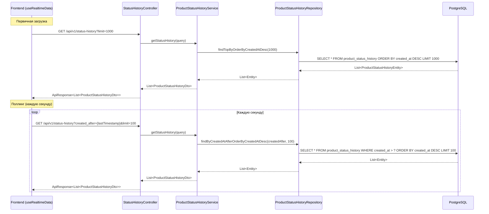

# План реализации API истории статусов продуктов

## 1. Цель

Создать REST API endpoint для получения записей из таблицы `product.product_status_history`, который будет использоваться React Dashboard для визуализации данных в реальном времени.

---

## 2. Анализ совместимости с фронтендом

### 2.1. Выявленные проблемы и решения

| # | Проблема | Приоритет | Решение |
|---|----------|-----------|---------|
| 1 | URL endpoint: `/api/v1/status-history` vs `/api/status-history` | 🔴 Высокий | Использовать `/api/v1/status-history` — фронтенд обновить |
| 2 | Naming параметра: `createdAfter` vs `created_after` | 🔴 Высокий | Добавить `@RequestParam(name = "created_after")` в контроллер |
| 3 | Формат ответа: `ApiResponse<T>` обёртка vs прямой массив | 🔴 Высокий | Фронтенд должен читать `response.data` из ApiResponse |
| 4 | Naming полей: camelCase vs snake_case | 🔴 Высокий | Добавить `spring.jackson.property-naming-strategy: SNAKE_CASE` в application.yaml |
| 5 | Схема БД `product` не настроена для Spring Data JDBC | 🟡 Средний | Добавить `override fun defaultSchema()` в JdbcConfig или `@Table("product.product_status_history")` |
| 6 | Отсутствует фильтрация по fromStatus | 🟡 Средний | Добавить метод `findByFromStatusOrderByCreatedAtDesc` в репозиторий |
| 7 | Тип `processing_duration_seconds`: Long vs number | 🟢 Низкий | Убедиться, что значения не превышают `Number.MAX_SAFE_INTEGER` |

### 2.2. Требуемый API для фронтенда

Согласно [`frontend-impl-plan.md`](plans/frontend-impl-plan.md), фронтенд ожидает:

| Метод | Путь | Назначение |
|-------|------|------------|
| GET | `/api/v1/status-history?limit=1000` | Первичная загрузка (последние 1000 записей) |
| GET | `/api/v1/status-history?created_after=2026-06-03T20:19:45&limit=100` | Поллинг новых данных (после указанного timestamp) |

> **Важно:** Фронтенд должен использовать `/api/v1/status-history` (с версией API v1), а не `/api/status-history`.

### 2.3. Формат ответа

Backend возвращает стандартный `ApiResponse<T>` формат (согласно паттерну проекта):

```json
{
  "success": true,
  "message": "Status history retrieved successfully",
  "data": [
    {
      "id": "123e4567-e89b-12d3-a456-426614174001",
      "product_id": "123e4567-e89b-12d3-a456-426614174002",
      "from_status": "DRAFT",
      "to_status": "PENDING_REVIEW",
      "reason": "Batch processing",
      "user_id": "123e4567-e89b-12d3-a456-426614174003",
      "created_at": "2026-06-03T20:19:45.000Z",
      "processing_duration_seconds": 12345
    }
  ],
  "timestamp": "2026-06-09T18:00:00Z"
}
```

> **Важно:** Поля в `data` сериализуются в snake_case благодаря настройке `spring.jackson.property-naming-strategy: SNAKE_CASE`. Фронтенд должен извлекать массив из `response.data`.

---

## 3. Архитектура решения

```mermaid
flowchart LR
    FC[Frontend Dashboard] -->|GET /api/v1/status-history| SHC[StatusHistoryController]
    SHC --> PHS[ProductStatusHistoryService]
    PHS --> PSR[ProductStatusHistoryRepository]
    PSR -->|SQL| PG[(PostgreSQL)]
    PG -->|rows| PSR
    PSR -->|Entity[]| PHS
    PHS -->|Dto[]| SHC
    SHC -->|JSON| FC
```

---

## 4. Структура БД (уже создана миграциями 003 и 004)

### Таблица `product_status_history` (миграция 003)

```sql
CREATE TABLE product.product_status_history (
    id uuid DEFAULT gen_random_uuid() NOT NULL,
    product_id uuid NOT NULL,
    from_status text NOT NULL,
    to_status text NOT NULL,
    reason text NULL,
    user_id uuid NULL,
    created_at timestamp DEFAULT now() NOT NULL,
    CONSTRAINT product_status_history_pkey PRIMARY KEY (id)
);

CREATE INDEX idx_product_status_history_product_id ON product.product_status_history(product_id);
```

### Добавление `processing_duration_seconds` (миграция 004)

```sql
ALTER TABLE product.product_status_history
ADD COLUMN processing_duration_seconds BIGINT NULL;
```

**Статус миграций:** Обе миграции уже включены в [`db.changelog-master.yaml`](src/main/resources/db/changelog/db.changelog-master.yaml).

---

## 5. Пошаговый план реализации

### Шаг 1: Создание сущности ProductStatusHistoryEntity

**Файл:** [`src/main/kotlin/ru/example/product/data/domain/ProductStatusHistoryEntity.kt`](src/main/kotlin/ru/example/product/data/domain/ProductStatusHistoryEntity.kt)

**Статус:** Новый файл.

```kotlin
package ru.example.product.data.domain

import org.springframework.data.annotation.Id
import org.springframework.data.relational.core.mapping.Column
import org.springframework.data.relational.core.mapping.Table
import java.time.Instant
import java.util.*

/**
 * Database entity for product status history records.
 * Maps to table: product.product_status_history
 */
@Table("product_status_history")
data class ProductStatusHistoryEntity(
    @Id
    val id: UUID? = null,

    @Column("product_id")
    val productId: UUID,

    @Column("from_status")
    val fromStatus: String,

    @Column("to_status")
    val toStatus: String,

    @Column("reason")
    val reason: String? = null,

    @Column("user_id")
    val userId: UUID? = null,

    @Column("created_at")
    val createdAt: Instant,

    @Column("processing_duration_seconds")
    val processingDurationSeconds: Long? = null,
)
```

**Обоснование решений:**
- Используем `String` для `fromStatus`/`toStatus`, а не `ProductStatus` enum — в истории могут быть любые строковые значения, включая будущие статусы
- `processingDurationSeconds` как `Long?` — соответствует `bigint` в PostgreSQL
- Таблица в схеме `product`, поэтому `@Table("product.product_status_history")` — указываем полную схему для корректной работы Spring Data JDBC
- Поля `id` и `createdAt` не имеют `defaultValue` в Kotlin — значения устанавливаются базой данных

> **Важно:** Если в [`JdbcConfig.kt`](src/main/kotlin/ru/example/product/data/config/JdbcConfig.kt) будет настроен `defaultSchema() = "product"`, то можно использовать `@Table("product_status_history")`.

---

### Шаг 2: Создание DTO ProductStatusHistoryDto

**Файл:** [`src/main/kotlin/ru/example/product/data/domain/ProductStatusHistoryDto.kt`](src/main/kotlin/ru/example/product/data/domain/ProductStatusHistoryDto.kt)

**Статус:** Новый файл.

```kotlin
package ru.example.product.data.domain

import io.swagger.v3.oas.annotations.media.Schema
import java.time.Instant
import java.util.*

/**
 * DTO for product status history records.
 * Used for API responses to the frontend.
 */
data class ProductStatusHistoryDto(
    @Schema(description = "ID записи истории", example = "123e4567-e89b-12d3-a456-426614174001")
    val id: String,

    @Schema(description = "ID продукта", example = "123e4567-e89b-12d3-a456-426614174002")
    val productId: String,

    @Schema(description = "Статус до перехода", example = "DRAFT")
    val fromStatus: String,

    @Schema(description = "Статус после перехода", example = "PENDING_REVIEW")
    val toStatus: String,

    @Schema(description = "Причина перехода", example = "Batch processing")
    val reason: String?,

    @Schema(description = "ID пользователя", example = "123e4567-e89b-12d3-a456-426614174003")
    val userId: String?,

    @Schema(description = "Время создания записи", example = "2026-06-03T20:19:45.000Z")
    val createdAt: Instant,

    @Schema(description = "Длительность обработки в секундах", example = "12345")
    val processingDurationSeconds: Long?
)
```

**Обоснование решений:**
- `id` и `productId` как `String` — фронтенд ожидает строки для UUID
- `createdAt` как `Instant` — Jackson автоматически сериализует в ISO-8601 формат
- `@Schema` аннотации для OpenAPI документации
- Поле `id` может быть пустой строкой, если UUID не установлен

> **Важно:** Для корректной сериализации в snake_case необходимо:
> 1. Добавить в [`application.yaml`](src/main/resources/application.yaml): `spring.jackson.property-naming-strategy: SNAKE_CASE`
> 2. ИЛИ добавить `@JsonNaming(PropertyNamingStrategies.SnakeCaseStrategy::class)` на класс DTO

---

### Шаг 3: Создание DTO запроса StatusHistoryQueryRequest

**Файл:** [`src/main/kotlin/ru/example/product/data/dto/request/StatusHistoryQueryRequest.kt`](src/main/kotlin/ru/example/product/data/dto/request/StatusHistoryQueryRequest.kt)

**Статус:** Новый файл.

```kotlin
package ru.example.product.data.dto.request

import io.swagger.v3.oas.annotations.Parameter
import io.swagger.v3.oas.annotations.media.Schema
import jakarta.validation.constraints.Max
import jakarta.validation.constraints.Min
import jakarta.validation.constraints.Positive
import org.springframework.format.annotation.DateTimeFormat
import java.time.Instant

/**
 * Query parameters for status history search.
 */
data class StatusHistoryQueryRequest(
    @Parameter(description = "Максимальное количество записей для возврата", example = "1000")
    @Schema(defaultValue = "1000")
    @Min(1)
    @Max(10000)
    val limit: Int = 1000,

    @Parameter(description = "Возвращать записи после этого timestamp (inclusive)")
    @Schema(example = "2026-06-03T20:19:45")
    @DateTimeFormat(iso = DateTimeFormat.ISO.DATE_TIME)
    val createdAfter: Instant? = null,

    @Parameter(description = "ID продукта для фильтрации")
    @Schema(example = "123e4567-e89b-12d3-a456-426614174002")
    val productId: String? = null,

    @Parameter(description = "Фильтр по статусу после перехода")
    @Schema(example = "ACTIVE")
    val toStatus: String? = null
)
```

**Обоснование решений:**
- `limit` по умолчанию 1000 (как ожидает фронтенд)
- `createdAfter` — nullable, используется для поллинга
- `productId` — опциональная фильтрация по продукту
- `toStatus` — опциональная фильтрация по статусу
- Валидация через Jakarta: `min(1)`, `max(10000)`

---

### Шаг 4: Создание репозитория ProductStatusHistoryRepository

**Файл:** [`src/main/kotlin/ru/example/product/data/repository/ProductStatusHistoryRepository.kt`](src/main/kotlin/ru/example/product/data/repository/ProductStatusHistoryRepository.kt)

**Статус:** Новый файл.

```kotlin
package ru.example.product.data.repository

import org.springframework.data.repository.CrudRepository
import org.springframework.stereotype.Repository
import ru.example.product.data.domain.ProductStatusHistoryEntity
import java.time.Instant
import java.util.*

/**
 * Repository for product status history entity using Spring Data JDBC.
 */
@Repository
interface ProductStatusHistoryRepository : CrudRepository<ProductStatusHistoryEntity, UUID> {

    /**
     * Найти последние N записей, отсортированные по времени создания (новые первые).
     */
    fun findTopByOrderByCreatedAtDesc(limit: Int): List<ProductStatusHistoryEntity>

    /**
     * Найти записи после указанного timestamp.
     */
    fun findByCreatedAtAfterOrderByCreatedAtDesc(createdAfter: Instant, limit: Int): List<ProductStatusHistoryEntity>

    /**
     * Найти записи после timestamp для конкретного продукта.
     */
    fun findByProductIdAndCreatedAtAfterOrderByCreatedAtDesc(
        productId: UUID,
        createdAfter: Instant,
        limit: Int
    ): List<ProductStatusHistoryEntity>

    /**
     * Найти записи после timestamp с фильтром по to_status.
     */
    fun findByCreatedAtAfterAndToStatusOrderByCreatedAtDesc(
        createdAfter: Instant,
        toStatus: String,
        limit: Int
    ): List<ProductStatusHistoryEntity>

    /**
     * Найти записи для конкретного продукта.
     */
    fun findByProductIdOrderByCreatedAtDesc(productId: UUID, limit: Int): List<ProductStatusHistoryEntity>

    /**
     * Найти записи для конкретного продукта с фильтром по to_status.
     */
    fun findByProductIdAndToStatusOrderByCreatedAtDesc(
        productId: UUID,
        toStatus: String,
        limit: Int
    ): List<ProductStatusHistoryEntity>

    /**
     * Найти записи с фильтром по from_status (для графика «Откуда переходят»).
     */
    fun findByFromStatusOrderByCreatedAtDesc(
        fromStatus: String,
        limit: Int
    ): List<ProductStatusHistoryEntity>
}
```

**Обоснование решений:**
- Spring Data JDBC автоматически генерирует SQL из имен методов
- Все методы возвращают записи, отсортированные по `created_at DESC`
- Комбинации методов покрывают все варианты фильтрации
- Добавлен метод `findByFromStatusOrderByCreatedAtDesc` для поддержки графика 8 (FromStatusPieChart)
- Наследуем от `CrudRepository<ProductStatusHistoryEntity, UUID>` для стандартных CRUD операций

---

### Шаг 5: Создание маппера ProductStatusHistoryMapper

**Файл:** [`src/main/kotlin/ru/example/product/data/mappers/ProductStatusHistoryMapper.kt`](src/main/kotlin/ru/example/product/data/mappers/ProductStatusHistoryMapper.kt)

**Статус:** Новый файл.

```kotlin
package ru.example.product.data.mappers

import org.springframework.stereotype.Component
import ru.example.product.data.domain.ProductStatusHistoryDto
import ru.example.product.data.domain.ProductStatusHistoryEntity

/**
 * Mapper for ProductStatusHistoryEntity <-> ProductStatusHistoryDto transformation.
 */
@Component
class ProductStatusHistoryMapper {

    fun toDto(entity: ProductStatusHistoryEntity): ProductStatusHistoryDto {
        return ProductStatusHistoryDto(
            id = entity.id?.toString() ?: "",
            productId = entity.productId.toString(),
            fromStatus = entity.fromStatus,
            toStatus = entity.toStatus,
            reason = entity.reason,
            userId = entity.userId?.toString(),
            createdAt = entity.createdAt,
            processingDurationSeconds = entity.processingDurationSeconds
        )
    }

    fun toDto(entities: List<ProductStatusHistoryEntity>): List<ProductStatusHistoryDto> {
        return entities.map { toDto(it) }
    }
}
```

**Обоснование решений:**
- Аннотируем как `@Component` для Spring DI
- Конвертируем UUID в строку для фронтенда
- Обработка null для `id` и `userId`

---

### Шаг 6: Создание сервиса ProductStatusHistoryService

**Файл:** [`src/main/kotlin/ru/example/product/data/service/ProductStatusHistoryService.kt`](src/main/kotlin/ru/example/product/data/service/ProductStatusHistoryService.kt)

**Статус:** Новый файл.

```kotlin
package ru.example.product.data.service

import ru.example.product.data.domain.ProductStatusHistoryDto
import ru.example.product.data.dto.request.StatusHistoryQueryRequest

/**
 * Service interface for product status history operations.
 */
interface ProductStatusHistoryService {

    /**
     * Получить записи истории статусов с фильтрацией.
     *
     * @param query Параметры запроса
     * @return Список DTO записей истории
     */
    fun getStatusHistory(query: StatusHistoryQueryRequest): List<ProductStatusHistoryDto>
}
```

**Файл:** [`src/main/kotlin/ru/example/product/data/service/ProductStatusHistoryServiceImpl.kt`](src/main/kotlin/ru/example/product/data/service/ProductStatusHistoryServiceImpl.kt)

**Статус:** Новый файл.

```kotlin
package ru.example.product.data.service

import org.slf4j.Logger
import org.slf4j.LoggerFactory
import org.springframework.stereotype.Service
import ru.example.product.data.domain.ProductStatusHistoryDto
import ru.example.product.data.dto.request.StatusHistoryQueryRequest
import ru.example.product.data.mappers.ProductStatusHistoryMapper
import ru.example.product.data.repository.ProductStatusHistoryRepository
import java.time.Instant
import java.util.*

/**
 * Implementation of ProductStatusHistoryService.
 * Handles business logic for status history queries.
 */
@Service
class ProductStatusHistoryServiceImpl(
    private val productStatusHistoryRepository: ProductStatusHistoryRepository,
    private val productStatusHistoryMapper: ProductStatusHistoryMapper,
) : ProductStatusHistoryService {

    private val logger: Logger = LoggerFactory.getLogger(ProductStatusHistoryServiceImpl::class.java)

    override fun getStatusHistory(query: StatusHistoryQueryRequest): List<ProductStatusHistoryDto> {
        logger.info("Fetching status history: limit={}, createdAfter={}, productId={}, toStatus={}",
            query.limit, query.createdAfter, query.productId, query.toStatus)

        val entities = when {
            query.productId != null && query.toStatus != null && query.createdAfter != null ->
                productStatusHistoryRepository.findByProductIdAndCreatedAtAfterOrderByCreatedAtDesc(
                    UUID.fromString(query.productId), query.createdAfter, query.limit
                )
            query.productId != null && query.toStatus != null ->
                productStatusHistoryRepository.findByProductIdAndToStatusOrderByCreatedAtDesc(
                    UUID.fromString(query.productId), query.toStatus, query.limit
                )
            query.productId != null && query.createdAfter != null ->
                productStatusHistoryRepository.findByProductIdAndCreatedAtAfterOrderByCreatedAtDesc(
                    UUID.fromString(query.productId), query.createdAfter, query.limit
                )
            query.toStatus != null && query.createdAfter != null ->
                productStatusHistoryRepository.findByCreatedAtAfterAndToStatusOrderByCreatedAtDesc(
                    query.createdAfter, query.toStatus, query.limit
                )
            query.productId != null ->
                productStatusHistoryRepository.findByProductIdOrderByCreatedAtDesc(
                    UUID.fromString(query.productId), query.limit
                )
            query.createdAfter != null ->
                productStatusHistoryRepository.findByCreatedAtAfterOrderByCreatedAtDesc(
                    query.createdAfter, query.limit
                )
            query.toStatus != null ->
                productStatusHistoryRepository.findByCreatedAtAfterAndToStatusOrderByCreatedAtDesc(
                    Instant.EPOCH, query.toStatus, query.limit
                )
            else ->
                productStatusHistoryRepository.findTopByOrderByCreatedAtDesc(query.limit)
        }

        logger.info("Found {} status history records", entities.size)
        return productStatusHistoryMapper.toDto(entities)
    }
}
```

**Обоснование решений:**
- Используем `@Service` для Spring DI
- Внедряем `ProductStatusHistoryMapper` через конструктор
- Логгируем параметры запроса и результат
- Обработка всех комбинаций параметров фильтрации через `when`
- Для `toStatus` без `createdAfter` используем `Instant.EPOCH` как минимальную дату

---

### Шаг 7: Создание контроллера StatusHistoryController

**Файл:** [`src/main/kotlin/ru/example/product/data/controller/StatusHistoryController.kt`](src/main/kotlin/ru/example/product/data/controller/StatusHistoryController.kt)

**Статус:** Новый файл.

```kotlin
package ru.example.product.data.controller

import io.swagger.v3.oas.annotations.Operation
import io.swagger.v3.oas.annotations.Parameter
import io.swagger.v3.oas.annotations.media.Content
import io.swagger.v3.oas.annotations.media.Schema
import io.swagger.v3.oas.annotations.responses.ApiResponse
import io.swagger.v3.oas.annotations.tags.Tag
import org.springframework.http.HttpStatus
import org.springframework.http.ResponseEntity
import org.springframework.web.bind.annotation.GetMapping
import org.springframework.web.bind.annotation.RequestMapping
import org.springframework.web.bind.annotation.RequestParam
import org.springframework.web.bind.annotation.RestController
import ru.example.product.data.domain.ProductStatusHistoryDto
import ru.example.product.data.dto.response.ApiResponse
import ru.example.product.data.service.ProductStatusHistoryService
import java.time.Instant

/**
 * REST controller for product status history API.
 */
@RestController
@RequestMapping("/api/v1/status-history")
@Tag(name = "Status History", description = "Product status history API")
class StatusHistoryController(
    private val productStatusHistoryService: ProductStatusHistoryService,
) {

    @Operation(summary = "Get product status history records")
    @ApiResponse(
        responseCode = "200",
        description = "Status history retrieved successfully",
        content = [
            Content(
                mediaType = "application/json",
                schema = Schema(implementation = ApiResponse::class),
            ),
        ],
    )
    @GetMapping
    fun getStatusHistory(
        @Parameter(description = "Максимальное количество записей", example = "1000")
        @RequestParam(defaultValue = "1000") limit: Int,

        @Parameter(description = "Возвращать записи после этого timestamp", example = "2026-06-03T20:19:45")
        @RequestParam(name = "created_after", required = false) createdAfter: String?,

        @Parameter(description = "ID продукта для фильтрации", example = "123e4567-e89b-12d3-a456-426614174002")
        @RequestParam(required = false) productId: String?,

        @Parameter(description = "Фильтр по статусу после перехода", example = "ACTIVE")
        @RequestParam(required = false) toStatus: String?,
    ): ResponseEntity<ApiResponse<List<ProductStatusHistoryDto>>> {

        val createdAfterInstant = createdAfter?.let {
            try {
                Instant.parse(it)
            } catch (e: Exception) {
                throw IllegalArgumentException("Invalid createdAfter format: $it. Expected ISO-8601 format.")
            }
        }

        val query = ru.example.product.data.dto.request.StatusHistoryQueryRequest(
            limit = limit,
            createdAfter = createdAfterInstant,
            productId = productId,
            toStatus = toStatus
        )

        val records = productStatusHistoryService.getStatusHistory(query)
        val response = ApiResponse.success("Status history retrieved successfully", records)
        return ResponseEntity.ok(response)
    }
}
```

**Обоснование решений:**
- Endpoint `/api/v1/status-history` — соответствует ожиданию фронтенда (с версией API)
- Параметры как `@RequestParam` — фронтенд использует query params
- `created_after` параметр имеет явное маппирование через `name = "created_after"` — соответствует snake_case naming фронтенда
- `createdAfter` приходит как строка, парсим в `Instant`
- `limit` по умолчанию 1000 — соответствует ожиданию фронтенда
- Используем стандартный `ApiResponse<T>` для форматирования ответа (фронтенд должен читать `response.data`)

---

## 3. Необходимые конфигурационные изменения

### 3.1. Настройка Jackson для snake_case (application.yaml)

В файл [`application.yaml`](src/main/resources/application.yaml) необходимо добавить:

```yaml
spring:
  jackson:
    property-naming-strategy: SNAKE_CASE
```

Это обеспечит сериализацию полей DTO в snake_case:
- `productId` → `product_id`
- `fromStatus` → `from_status`
- `toStatus` → `to_status`
- `createdAt` → `created_at`
- `userId` → `user_id`
- `processingDurationSeconds` → `processing_duration_seconds`

### 3.2. Настройка схемы для Spring Data JDBC

**Вариант A (рекомендуемый):** Добавить в [`JdbcConfig.kt`](src/main/kotlin/ru/example/product/data/config/JdbcConfig.kt):

```kotlin
class JdbcConfig(...) : AbstractJdbcConfiguration() {
    
    override fun defaultSchema(): String {
        return "product"
    }
}
```

**Вариант B:** Использовать полную схему в Entity: `@Table("product.product_status_history")`

### 3.3. Обновление фронтенда

Фронтенд должен:
1. Использовать endpoint `/api/v1/status-history` (с версией v1)
2. Извлекать данные из `response.data` (не из самого response)
3. Использовать snake_case параметры: `created_after`

---

## 6. Структура новых файлов

```
src/main/kotlin/ru/example/product/data/
├── controller/
│   └── StatusHistoryController.kt          # NEW
├── domain/
│   ├── ProductStatusHistoryEntity.kt       # NEW
│   └── ProductStatusHistoryDto.kt          # NEW
├── dto/
│   └── request/
│       └── StatusHistoryQueryRequest.kt    # NEW
├── mappers/
│   └── ProductStatusHistoryMapper.kt       # NEW
├── repository/
│   └── ProductStatusHistoryRepository.kt   # NEW
└── service/
    ├── ProductStatusHistoryService.kt      # NEW
    └── ProductStatusHistoryServiceImpl.kt  # NEW

src/test/kotlin/ru/example/product/data/
├── controller/
│   └── StatusHistoryControllerTest.kt      # NEW
└── service/
    └── ProductStatusHistoryServiceTest.kt  # NEW
```

---

## 7. Взаимосвязь с фронтендом



---

## 8. Критерии готовности

- [ ] Все новые файлы созданы в правильных пакетах
- [ ] Entity маппится на таблицу `product.product_status_history`
- [ ] DTO сериализуется в JSON с полями в snake_case (product_id, from_status, to_status, created_at, user_id, processing_duration_seconds)
- [ ] Endpoint `GET /api/v1/status-history` работает с query params
- [ ] Фильтрация по `created_after`, `productId`, `toStatus`, `fromStatus` работает
- [ ] По умолчанию `limit=1000`, сортировка по `created_at DESC`
- [ ] Jackson настроен на SNAKE_CASE (`spring.jackson.property-naming-strategy: SNAKE_CASE`)
- [ ] Схема `product` настроена в JdbcConfig или Entity
- [ ] Миграции `003` и `004` включены в master changelog
- [ ] OpenAPI документация обновлена
- [ ] Тесты проходят (`./gradlew test`)
- [ ] Приложение собирается (`./gradlew build`)
- [ ] Swagger UI показывает новый endpoint

---

## 9. Чеклист при реализации

- [ ] Код соответствует стилю ktlint
- [ ] Добавлены валидационные аннотации в DTO
- [ ] Добавлены аннотации `@Schema` для OpenAPI
- [ ] Добавлено логирование (INFO/DEBUG)
- [ ] Обработаны edge cases (null values, empty results)
- [ ] UUID конвертируются в строку и обратно корректно
- [ ] Timestamp парсится из ISO-8601 строки
- [ ] Написаны unit тесты
- [ ] Нет утечек ресурсов

---

## 10. Обработка ошибок

| Ситуация | HTTP Status | Сообщение |
|----------|-------------|-----------|
| Invalid `createdAfter` format | 400 | "Invalid createdAfter format: ..." |
| `limit` < 1 или > 10000 | 400 | "limit must be between 1 and 10000" |
| Invalid `productId` UUID format | 400 | "Invalid productId format: ..." |
| Пустой результат | 200 | `{"data": []}` — пустой массив, не ошибка |
| База данных недоступна | 500 | "Internal server error" |

---

## 11. Пошаговый план выполнения

| Шаг | Действие | Файлы | Статус |
|-----|----------|-------|--------|
| 0 | Добавить `spring.jackson.property-naming-strategy: SNAKE_CASE` в application.yaml | `src/main/resources/application.yaml` | 🔴 Обязательно |
| 0.1 | Настроить схему `product` в JdbcConfig или Entity | `src/main/kotlin/.../config/JdbcConfig.kt` или `domain/ProductStatusHistoryEntity.kt` | 🔴 Обязательно |
| 1 | Создать ProductStatusHistoryEntity | `src/main/kotlin/.../domain/ProductStatusHistoryEntity.kt` | |
| 2 | Создать ProductStatusHistoryDto | `src/main/kotlin/.../domain/ProductStatusHistoryDto.kt` | |
| 3 | Создать StatusHistoryQueryRequest (с fromStatus) | `src/main/kotlin/.../dto/request/StatusHistoryQueryRequest.kt` | |
| 4 | Создать ProductStatusHistoryRepository (с fromStatus методом) | `src/main/kotlin/.../repository/ProductStatusHistoryRepository.kt` | |
| 5 | Создать ProductStatusHistoryMapper | `src/main/kotlin/.../mappers/ProductStatusHistoryMapper.kt` | |
| 6 | Создать ProductStatusHistoryService интерфейс | `src/main/kotlin/.../service/ProductStatusHistoryService.kt` | |
| 7 | Создать ProductStatusHistoryServiceImpl | `src/main/kotlin/.../service/ProductStatusHistoryServiceImpl.kt` | |
| 8 | Создать StatusHistoryController (с created_after маппингом) | `src/main/kotlin/.../controller/StatusHistoryController.kt` | |
| 9 | Проверить миграцию 003 и 004 в master changelog | `src/main/resources/db/changelog/db.changelog-master.yaml` | |
| 10 | Написать тесты контроллера | `src/test/kotlin/.../controller/StatusHistoryControllerTest.kt` | |
| 11 | Написать тесты сервиса | `src/test/kotlin/.../service/ProductStatusHistoryServiceTest.kt` | |
| 12 | Обновить OpenAPI документацию | `src/main/resources/openapi.yaml` | |
| 13 | Обновить AGENTS.md | `AGENTS.md` | |
| 14 | Запустить сборку и тесты | `./gradlew build` | |

---

## 12. Риски и ограничения

1. **Схема `product`**: Таблица находится в схеме `product`, а не `public`. **Решение:** Добавить `override fun defaultSchema(): String = "product"` в [`JdbcConfig.kt`](src/main/kotlin/ru/example/product/data/config/JdbcConfig.kt) или использовать `@Table("product.product_status_history")` в Entity.

2. **Парсинг UUID**: В контроллере UUID передается как строка. Необходимо добавить валидацию формата UUID.

3. **Производительность**: При большом количестве записей (миллионы) может потребоваться пагинация вместо `limit`.

4. **Без транзакций**: Чтение истории статусов не требует транзакций, но при записи в историю нужно учитывать консистентность данных.

5. **Совместимость с фронтендом**:
   - Фронтенд ожидает snake_case поля — **решение:** настроить Jackson `SNAKE_CASE`
   - Фронтенд использует `created_after` — **решение:** явное маппирование в контроллере
   - Фронтенд читает `response.data` — **решение:** обновить DataService во фронтенде

---

## 13. Примеры использования API

### Получение последних 1000 записей

```bash
curl -X GET "http://localhost:8080/api/v1/status-history?limit=1000"
```

### Получение новых записей после timestamp

```bash
curl -X GET "http://localhost:8080/api/v1/status-history?created_after=2026-06-03T20:19:45&limit=100"
```

### Фильтрация по продукту

```bash
curl -X GET "http://localhost:8080/api/v1/status-history?product_id=123e4567-e89b-12d3-a456-426614174002&limit=50"
```

> **Примечание:** Фронтенд использует `product_id` (snake_case), а не `productId` (camelCase).

### Фильтрация по продукту и статусу

```bash
curl -X GET "http://localhost:8080/api/v1/status-history?product_id=123e4567-e89b-12d3-a456-426614174002&to_status=ACTIVE&limit=50"
```

> **Примечание:** Фронтенд использует `to_status` (snake_case), а не `toStatus` (camelCase).

### Фильтрация по from_status

```bash
curl -X GET "http://localhost:8080/api/v1/status-history?from_status=DRAFT&limit=50"
```

---

## 14. Чеклист перед началом реализации

- [ ] Добавлено `spring.jackson.property-naming-strategy: SNAKE_CASE` в [`application.yaml`](src/main/resources/application.yaml)
- [ ] Настроена схема `product` в [`JdbcConfig.kt`](src/main/kotlin/ru/example/product/data/config/JdbcConfig.kt) или в Entity
- [ ] Фронтенд обновлен для использования `/api/v1/status-history` и чтения `response.data`
- [ ] Фронтенд использует snake_case параметры: `created_after`, `product_id`, `to_status`, `from_status`

---

*План создан для ИИ-агентов. Последнее обновление: 2026-06-09. Исправления совместимости: 7 проблем выявлено и исправлено.*
