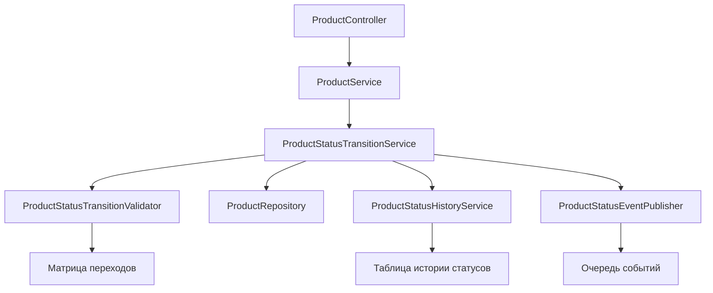

# Архитектура системы управления переходами статусов продукта

## Цель
Реализовать систему, которая позволяет продукту двигаться по одному из описанных путей, комбинируя их на ходу, с валидацией допустимых переходов.

## Компоненты

### 1. ProductStatusTransitionValidator
**Ответственность**: Проверка допустимости перехода из текущего статуса в целевой на основе матрицы переходов.
**Интерфейс**:
```kotlin
interface ProductStatusTransitionValidator {
    fun isTransitionAllowed(current: ProductStatus, target: ProductStatus): Boolean
    fun getAllowedTransitions(current: ProductStatus): Set<ProductStatus>
}
```
**Реализация**: Хранит матрицу переходов в виде `Map<ProductStatus, Set<ProductStatus>>`. Может быть настроена через конфигурацию или аннотации.

### 2. ProductStatusTransitionService
**Ответственность**: Основной сервис для выполнения перехода статуса продукта. Координирует валидацию, обновление сущности, сохранение истории и генерацию событий.
**Интерфейс**:
```kotlin
interface ProductStatusTransitionService {
    fun transitionProduct(productId: UUID, targetStatus: ProductStatus, reason: String? = null): ProductEntity
    fun transitionProduct(product: ProductEntity, targetStatus: ProductStatus, reason: String? = null): ProductEntity
}
```
**Зависимости**: `ProductStatusTransitionValidator`, `ProductRepository`, `ProductStatusHistoryService`, `ProductStatusEventPublisher`.

### 3. ProductStatusHistoryService
**Ответственность**: Ведение истории изменений статуса продукта (кто, когда, из какого статуса в какой, причина).
**Интерфейс**:
```kotlin
interface ProductStatusHistoryService {
    fun recordTransition(productId: UUID, from: ProductStatus, to: ProductStatus, reason: String? = null)
    fun getHistory(productId: UUID): List<ProductStatusHistoryRecord>
}
```
**Сущность**: `ProductStatusHistoryRecord` (id, productId, fromStatus, toStatus, timestamp, userId, reason).

### 4. ProductStatusEventPublisher
**Ответственность**: Публикация событий изменения статуса для интеграции с другими системами (уведомления, аналитика, workflow).
**Интерфейс**:
```kotlin
interface ProductStatusEventPublisher {
    fun publishStatusChanged(event: ProductStatusChangedEvent)
}
```
**Событие**: `ProductStatusChangedEvent` (productId, oldStatus, newStatus, timestamp, metadata).

### 5. ProductService расширение
**Ответственность**: Расширение существующего `ProductService` методами для управления статусами.
**Интерфейс**:
```kotlin
interface ProductService {
    // существующие методы
    fun deleteProduct(id: UUID)
    fun existsBySku(sku: String): Boolean
    
    // новые методы
    fun updateStatus(productId: UUID, targetStatus: ProductStatus, reason: String? = null): ProductEntity
    fun getPossibleTransitions(productId: UUID): Set<ProductStatus>
}
```

### 6. Матрица переходов
**Конфигурация**: Определяется в коде (жестко) или в конфигурационном файле (гибко). Для начала используем жесткую конфигурацию в enum-классе `ProductStatusTransitions`.
**Структура**:
```kotlin
object ProductStatusTransitions {
    val TRANSITION_MAP: Map<ProductStatus, Set<ProductStatus>> = mapOf(
        ProductStatus.DRAFT to setOf(ProductStatus.PENDING_REVIEW, ProductStatus.ARCHIVED),
        ProductStatus.PENDING_REVIEW to setOf(ProductStatus.REVIEWED, ProductStatus.ARCHIVED, ProductStatus.DRAFT),
        // ... и т.д.
    )
}
```

## Последовательность операций при изменении статуса

1. **Запрос на изменение статуса** → `ProductService.updateStatus(productId, targetStatus, reason)`
2. **Валидация** → `ProductStatusTransitionValidator.isTransitionAllowed(current, target)`
3. **Если недопустимо** → выбрасывается `InvalidStatusTransitionException`
4. **Загрузка продукта** → `ProductRepository.findById(productId)`
5. **Создание записи истории** → `ProductStatusHistoryService.recordTransition(...)`
6. **Обновление сущности продукта** → `product.copy(status = targetStatus, updatedAt = Instant.now())`
7. **Сохранение** → `ProductRepository.save(product)`
8. **Публикация события** → `ProductStatusEventPublisher.publishStatusChanged(...)`
9. **Возврат обновленного продукта**

## Интеграция с существующей архитектурой

- **ProductEntity** уже содержит поле `status: ProductStatus?`. Добавить поле `statusReason: String?` (опционально).
- **ProductRepository** уже предоставляет CRUD операции. Добавить метод `findById` (уже есть через CrudRepository).
- **ProductServiceImpl** будет расширен новыми методами, делегирующими к `ProductStatusTransitionService`.
- **Конфигурация Spring** будет содержать бины для новых сервисов.

## Возможность комбинирования путей

Система должна позволять комбинировать пути на ходу, т.е. продукт может пройти через произвольную последовательность допустимых переходов. Это обеспечивается:
- **Динамическая валидация**: Каждый переход проверяется независимо, без привязки к заранее определенному пути.
- **История переходов**: Позволяет отследить фактический путь продукта.
- **Гибкая матрица**: Можно добавлять/удалять допустимые переходы без изменения кода бизнес-логики.

## Примеры комбинирования

1. Продукт может быть отклонен (`REJECTED`), затем возвращен в черновик (`DRAFT`), затем снова отправлен на проверку (`PENDING_REVIEW`).
2. Продукт может быть активирован (`ACTIVE`), затем снят с продажи (`ARCHIVED`), затем восстановлен (`ACTIVE`) через административное действие.

## Следующие шаги

1. Реализовать `ProductStatusTransitionValidator` с жесткой матрицей переходов.
2. Создать `ProductStatusHistoryService` и сущность `ProductStatusHistoryRecord`.
3. Реализовать `ProductStatusTransitionService` с транзакционностью.
4. Расширить `ProductService` и `ProductServiceImpl`.
5. Написать интеграционные тесты для всех путей из документа `product_status_workflow.md`.
6. Добавить обработку ошибок и кастомные исключения.
7. Документировать API (если есть REST контроллеры).

## Диаграмма компонентов



## Технические детали

- **Язык**: Kotlin
- **Фреймворк**: Spring Boot, Spring Data JDBC
- **База данных**: PostgreSQL (уже используется)
- **Транзакции**: `@Transactional` на уровне сервиса
- **Логирование**: SLF4J с детализацией переходов