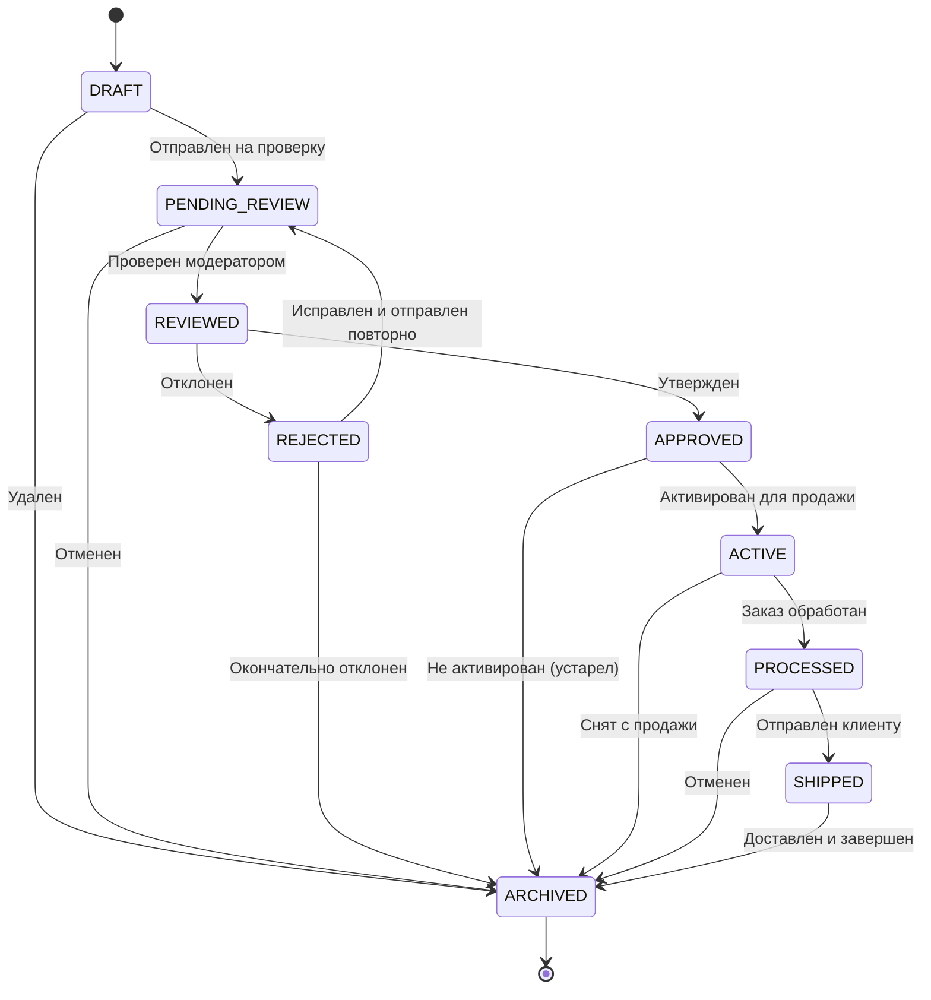

# Правила переходов между статусами продукта

## Текущие статусы

| Статус | Код | Описание |
|--------|-----|----------|
| DRAFT | 0 | Черновик продукта |
| PENDING_REVIEW | 10 | Ожидает проверки |
| REVIEWED | 20 | Проверено модератором |
| APPROVED | 30 | Утверждено менеджером |
| REJECTED | 40 | Отклонено |
| ACTIVE | 50 | Активно для продажи |
| PROCESSED | 60 | Обработано (заказ собран) |
| SHIPPED | 70 | Отправлено клиенту |
| ARCHIVED | 80 | Архивировано (завершено) |

## Диаграмма состояний

## Пронумерованные пути движения продукта

Путь — это последовательность статусов от начального до конечного состояния, отражающая полный жизненный цикл продукта. Ниже представлены типичные пути, которые может пройти продукт.

### Путь 1: Успешный основной workflow
**Описание**: Продукт создается, проходит проверку, утверждается, продается, отправляется и архивируется.
**Последовательность**:
`DRAFT` → `PENDING_REVIEW` → `REVIEWED` → `APPROVED` → `ACTIVE` → `PROCESSED` → `SHIPPED` → `ARCHIVED`

### Путь 2: Отклонение с последующим исправлением
**Описание**: Продукт отклонен на этапе проверки, исправлен и повторно отправлен, после чего успешно проходит весь workflow.
**Последовательность**:
`DRAFT` → `PENDING_REVIEW` → `REVIEWED` → `REJECTED` → `PENDING_REVIEW` → `REVIEWED` → `APPROVED` → `ACTIVE` → `PROCESSED` → `SHIPPED` → `ARCHIVED`

### Путь 3: Досрочное архивирование (отмена)
**Описание**: Продукт отменен на этапе проверки и сразу архивируется.
**Последовательность**:
`DRAFT` → `PENDING_REVIEW` → `ARCHIVED`

### Путь 4: Отклонение и окончательный отказ
**Описание**: Продукт отклонен и окончательно архивирован без повторной отправки.
**Последовательность**:
`DRAFT` → `PENDING_REVIEW` → `REVIEWED` → `REJECTED` → `ARCHIVED`

### Путь 5: Устаревание после утверждения
**Описание**: Продукт утвержден, но не активирован (например, истек срок) и архивируется.
**Последовательность**:
`DRAFT` → `PENDING_REVIEW` → `REVIEWED` → `APPROVED` → `ARCHIVED`

### Путь 6: Снятие с продажи
**Описание**: Активный продукт снят с продажи и архивирован.
**Последовательность**:
`DRAFT` → `PENDING_REVIEW` → `REVIEWED` → `APPROVED` → `ACTIVE` → `ARCHIVED`

### Путь 7: Отмена заказа после обработки
**Описание**: Продукт был обработан, но заказ отменен до отправки.
**Последовательность**:
`DRAFT` → `PENDING_REVIEW` → `REVIEWED` → `APPROVED` → `ACTIVE` → `PROCESSED` → `ARCHIVED`

### Путь 8: Прямое удаление черновика
**Описание**: Черновик продукта удаляется без отправки на проверку.
**Последовательность**:
`DRAFT` → `ARCHIVED`

### Путь 9: Возврат в черновик для правок
**Описание**: Продукт возвращен в черновик для доработки после отправки на проверку.
**Последовательность**:
`DRAFT` → `PENDING_REVIEW` → `DRAFT` (далее возможны повторные переходы)

### Путь 10: Восстановление из архива
**Описание**: Архивированный продукт восстановлен и снова активирован (административная операция).
**Последовательность**:
`ARCHIVED` → `ACTIVE` → `PROCESSED` → `SHIPPED` → `ARCHIVED`

> **Примечание**: Пути могут комбинироваться и варьироваться в зависимости от бизнес-сценариев. Приведенные выше пути охватывают наиболее типичные случаи.

## Детальные правила переходов

### Матрица допустимых переходов
| Из статуса | В статус (допустимые) |
|------------|----------------------|
| DRAFT | PENDING_REVIEW, ARCHIVED |
| PENDING_REVIEW | REVIEWED, ARCHIVED, DRAFT (опционально) |
| REVIEWED | APPROVED, REJECTED |
| APPROVED | ACTIVE, ARCHIVED |
| REJECTED | PENDING_REVIEW, ARCHIVED |
| ACTIVE | PROCESSED, ARCHIVED |
| PROCESSED | SHIPPED, ARCHIVED |
| SHIPPED | ARCHIVED |
| ARCHIVED | ACTIVE (только через восстановление) |

### Бизнес-логика

### Бизнес-логика
- Продукт в статусе `REJECTED` не может быть активирован без повторной проверки.
- Продукт в статусе `ARCHIVED` является конечным состоянием (нельзя вернуть в активные статусы без специальной процедуры восстановления).
- Статус `ACTIVE` означает, что продукт доступен для покупки.
- Статус `PROCESSED` означает, что заказ собран и готов к отправке.
- Статус `SHIPPED` означает, что продукт физически отправлен клиенту.

## Рекомендации по реализации

### 1. Валидация переходов
Создать сервис `ProductStatusTransitionService` с методом `isTransitionAllowed(current: ProductStatus, target: ProductStatus): Boolean`, который проверяет допустимость перехода согласно правилам выше.

### 2. Матрица переходов
Реализовать матрицу допустимых переходов в виде `Map<ProductStatus, Set<ProductStatus>>`.

### 3. События статусов
Рассмотреть использование событий (Domain Events) при изменении статуса для интеграции с другими системами (уведомления, логирование).

### 4. Расширение enum
Добавить в `ProductStatus` методы-хелперы:
- `fun canTransitionTo(target: ProductStatus): Boolean`
- `fun getPossibleTransitions(): Set<ProductStatus>`

### 5. История статусов
Ввести сущность `ProductStatusHistory` для отслеживания всех изменений статуса с timestamp и причиной.

## Следующие шаги
1. Обсудить предложенные правила с бизнес-аналитиком.
2. Реализовать валидацию переходов в сервисе ProductService.
3. Добавить методы для изменения статуса с проверкой правил.
4. Создать тесты для всех возможных переходов.
5. Обновить документацию API (если есть).