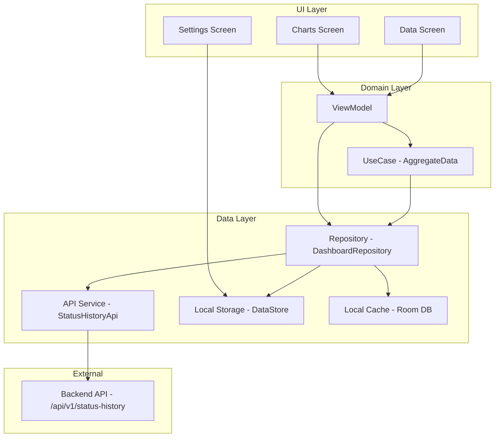

# План разработки Android-приложения "Product Status History Dashboard"

## Обзор проекта

Разработка нативного Android-приложения для визуализации аналитики статусов продуктов. Приложение потребляет сырые данные с бэкенда (`GET /api/v1/status-history`) и агрегирует их локально для отображения в виде интерактивного дашборда с графиками.

---

## Архитектурная схема



---

## Этапы разработки

### Этап 1: Инициализация проекта и настройка инфраструктуры

- [ ] 1.1. Создать новый проект в Android Studio (Empty Activity with Compose)
- [ ] 1.2. Настроить `build.gradle.kts` (project level) - добавить репозитории и плагины
- [ ] 1.3. Настроить `build.gradle.kts` (app level) - добавить зависимости
- [ ] 1.4. Создать структуру пакетов по Clean Architecture
- [ ] 1.5. Настроить Hilt для Dependency Injection
- [ ] 1.6. Настроить Timber для логирования
- [ ] 1.7. Настроить BuildConfig для переключения Base URL (debug/release)

**Зависимости:**
```
- com.squareup.retrofit2:retrofit
- com.squareup.retrofit2:converter-kotlinx-serialization
- com.squareup.okhttp3:okhttp
- com.squareup.okhttp3:logging-interceptor
- com.google.dagger:hilt-android
- com.google.dagger:hilt-compiler
- androidx.compose.ui:ui
- androidx.compose.material3:material3
- androidx.navigation:navigation-compose
- com.patrykandpatrick.vico:compose
- androidx.datastore:datastore-preferences
- androidx.room:room-runtime
- androidx.room:room-ktx
- androidx.room:room-compiler
- kotlinx.coroutines:coroutines-android
- kotlinx.serialization:kotlinx-serialization-json
- com.jakewharton.timber:timber
- androidx.security:security-crypto
```

---

### Этап 2: Data Layer - Работа с API

- [ ] 2.1. Создать модель `StatusHistoryRecord` (на основе типов веб-проекта)
- [ ] 2.2. Создать обертку ответа `ApiResponse<T>`
- [ ] 2.3. Создать интерфейс API `StatusHistoryApi` с методом `GET /api/v1/status-history?limit={limit}`
- [ ] 2.4. Настроить Retrofit с OkHttp, Logging Interceptor и Kotlin Serialization
- [ ] 2.5. Создать `ApiModule` для Hilt (Retrofit instance)
- [ ] 2.6. Реализовать `DashboardRepository` с методом получения данных
- [ ] 2.7. Добавить обработку ошибок (HTTP 4xx/5xx, Network Error, Parse Error)
- [ ] 2.8. Добавить AuthInterceptor для Bearer Token авторизации

**Модель данных (предварительная):**
```kotlin
data class StatusHistoryRecord(
    val id: String,
    val productId: String,
    val fromStatus: String?,
    val toStatus: String,
    val reason: String?,
    val timestamp: String,
    val userId: String?,
    val processingTimeMs: Long?
)

data class ApiResponse<T>(
    val success: Boolean,
    val data: T?,
    val message: String?
)
```

---

### Этап 2.5: Data Layer - Локальное кэширование (Room)

- [ ] 2.5.1. Создать Entity `StatusHistoryEntity` для Room
- [ ] 2.5.2. Создать DAO `StatusHistoryDao` с методами insert, getAll, exists
- [ ] 2.5.3. Создать `AppDatabase` с Hilt модулем
- [ ] 2.5.4. Реализовать `LocalDataSource` для работы с Room
- [ ] 2.5.5. Добавить кэширование в Repository (сначала кэш, потом API)
- [ ] 2.5.6. Реализовать инвалидацию кэша при Pull-to-Refresh

---

### Этап 3: Domain Layer - Агрегация данных

- [ ] 3.1. Создать модель `AggregatedDashboard` для агрегированных данных
- [ ] 3.2. Реализовать функцию агрегации `toAggregatedData()` на основе списка `StatusHistoryRecord`
- [ ] 3.3. Создать UseCase `AggregateDashboardDataUseCase`
- [ ] 3.4. Реализовать маппинг сырых данных в метрики для графиков

**Логика агрегации:**
```
StatusTransitions: groupBy { toStatus } -> mapValues { size }
AvgProcessingTime: mapNotNull { processingTimeMs } -> average()
TopProducts: groupBy { productId } -> mapValues { size } -> sortDescending -> take(10)
TransitionReasons: groupBy { reason ?: "Unknown" } -> mapValues { size }
StatusShare: groupBy { toStatus } -> calculate percentages
ReasonShare: groupBy { reason ?: "Unknown" } -> calculate percentages
SourceStatuses: groupBy { fromStatus ?: "Unknown" } -> mapValues { size }
HourlyActivity: groupBy { hourOf(timestamp) } -> mapValues { size }
```

---

### Этап 4: Design System - Цвета и темы

- [ ] 4.1. Создать `colors.kt` с цветовыми константами бренда
- [ ] 4.2. Создать `themes.kt` с Material 3 темой
- [ ] 4.3. Настроить цветовую схему для графиков

**Цветовая схема:**
| Статус | Цвет | Hex |
|--------|------|-----|
| ARCHIVED / DRAFT | Фиолетовый | `#8E86D6` |
| PENDING_REVIEW / APPROVED | Зеленый | `#9ACD9A` |
| REJECTED / REVIEWED | Оранжевый | `#F28C38` |
| REJECTED (light) | Желтый | `#FAD7A0` |

---

### Этап 5: UI - Навигация и базовая структура

- [ ] 5.1. Создать `BottomNavigation` с 3 вкладками (Charts, Data, Settings)
- [ ] 5.2. Настроить Navigation Compose с графами навигации
- [ ] 5.3. Создать `AppNavHost` как точку входа навигации
- [ ] 5.4. Добавить иконки для вкладок (Charts, Data, Settings)
- [ ] 5.5. Добавить `BuildConfig` для переключения Base URL (debug/release)
- [ ] 5.6. Настроить хранение секретов через `secrets-gradle-plugin`

---

### Этап 6: UI - Экран Charts (Дашборд)

- [ ] 6.1. Создать `DashboardScreen` с `LazyVerticalGrid`
- [ ] 6.2. Реализовать адаптивную сетку `GridCells.Adaptive(300.dp)`
- [ ] 6.3. Создать компонент `DashboardCard` с состояниями (Loading/Error/Empty/Data)
- [ ] 6.4. Добавить Pull-to-Refresh через `PullRefreshIndicator`
- [ ] 6.5. Реализовать Shimmer-эффект для loading-состояния
- [ ] 6.6. Добавить тултипы (всплывающие подсказки) при тапе на сегменты графиков

**Виджеты для реализации:**

| № | Виджет | Тип графика | Источник данных |
|---|--------|-------------|-----------------|
| 1 | Переходы по статусам | Vertical Bar Chart | `statusTransitions` |
| 2 | Среднее время обработки | Single Bar / Gauge | `avgProcessingTime` |
| 3 | Топ продуктов | Horizontal Bar Chart | `topProducts` |
| 4 | Причины переходов | Vertical Bar Chart | `transitionReasons` |
| 5 | Доля статусов | Pie Chart | `statusShare` |
| 6 | Доля причин | Donut Chart | `reasonShare` |
| 7 | Откуда переходят | Pie Chart | `sourceStatuses` |
| 8 | Активность по часам | Radial Bar / Pie | `hourlyActivity` |
| 9 | Активность пользователей | Заглушка | - |

---

### Этап 7: UI - Экран Data (Таблица)

- [ ] 7.1. Создать `DataScreen` с `LazyColumn`
- [ ] 7.2. Отобразить сырые записи `StatusHistoryRecord`
- [ ] 7.3. Реализовать пагинацию (Paging 3 или бесконечный скролл)
- [ ] 7.4. Добавить форматирование timestamp и статусов

---

### Этап 8: UI - Экран Settings (Настройки)

- [ ] 8.1. Создать `SettingsScreen` с настройками
- [ ] 8.2. Добавить поле `Initial Limit` (default: 50) с сохранением в DataStore
- [ ] 8.3. Добавить поле `Poll Interval` (default: 30 сек) - опционально
- [ ] 8.4. Добавить кнопку "Reset to Defaults"
- [ ] 8.5. Настроить DataStore Preferences для хранения настроек

---

### Этап 9: Финализация и тестирование

- [ ] 9.1. Настроить Base URL через BuildConfig (debugUrl / releaseUrl)
- [ ] 9.2. Настроить механизм авторизации (Bearer Token из DataStore)
- [ ] 9.3. Протестировать парсинг JSON из реального ответа API
- [ ] 9.4. Проверить работу оффлайн-режима (кэш Room)
- [ ] 9.5. Протестировать тултипы на всех типах графиков
- [ ] 9.6. Проверить адаптивность при повороте экрана
- [ ] 9.7. Проверить обработку ошибок (offline, HTTP errors)
- [ ] 9.8. Убедиться в совместимости с Android 8.0+ (API 26)
- [ ] 9.9. Кросс-тестирование на разных размерах экранов

---

## Критерии приемки (DoD)

1. Приложение собирается и запускается на Android 8.0+ (API 26)
2. Все графики из веб-версии отображаются корректно
3. Цвета графиков соответствуют брендбуку/веб-версии
4. При повороте экрана верстка адаптируется (сетка перестраивается)
5. При отсутствии интернета показываются кэшированные данные (Room), а не краш
6. Данные обновляются при свайпе вниз
7. Настройки сохраняются и применяются немедленно
8. Тултипы работают на всех типах графиков
9. Base URL переключается через BuildConfig (debug/release)

---

## Ответы на вопросы (Open Points - ЗАКРЫТО)

| Вопрос | Ответ | Статус |
|--------|-------|--------|
| Endpoint | `GET /api/v1/status-history?limit={initialLimit}` | ✅ Подтверждено |
| Авторизация | Bearer Token, хранится в DataStore | ✅ Решено |
| Виджет активности | Убрать или показать заглушку "Данные отсутствуют" | ✅ Решено |
| Тултипы | Добавить для всех типов графиков | ✅ Решено |
| Кэширование | Room для offline-режима | ✅ Решено |
| Base URL | BuildConfig (debugUrl / releaseUrl) | ✅ Решено |
| Структура данных | Скопировать из веб-проекта перед стартом | ⏳ Требуется |

---

## Рекомендации

1. **Перед началом разработки:** Открыть DevTools (F12) на сайте, перейти во вкладку Network, найти запрос дашборда и скопировать JSON-ответ для точного маппинга моделей.
2. **Агрегация на клиенте:** Ключевое отличие от веба - Android получает сырые данные и агрегирует их локально. Это архитектурное решение нужно согласовать с бэкенд-командой.
3. **Библиотека графиков:** Рекомендуется Vico для нативной Compose-интеграции.
4. **Безопасность:** Использовать `androidx.security:security-crypto` для шифрования токенов в DataStore.
