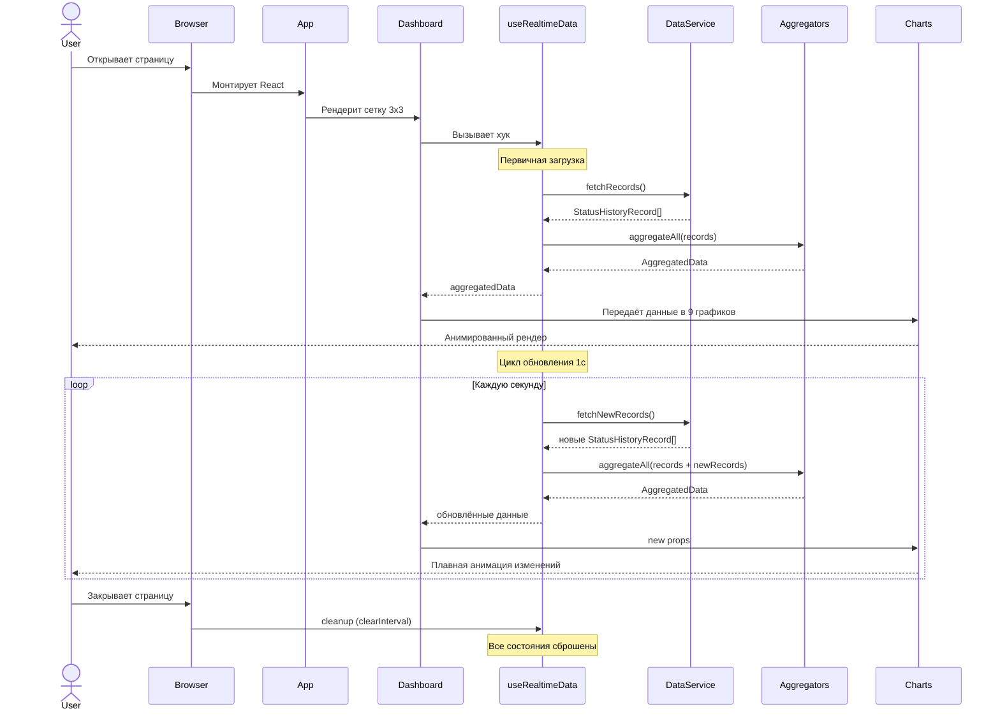

# План реализации: Страница с 9 анимированными графиками

## 1. Цель
Создать страницу с 9 графиками для визуализации данных из таблицы `product.product_status_history`. Данные обновляются каждую секунду с анимацией переходов.

## 2. Жизненный цикл страницы (что происходит при открытии)

При открытии страницы с графиками выполняется следующая последовательность действий:

### 2.1. Монтирование Dashboard

1. Пользователь открывает страницу (например, `http://localhost:5173`)
2. React монтирует корневой компонент [`App.tsx`](src/App.tsx), который рендерит [`Dashboard.tsx`](src/components/Dashboard.tsx)
3. [`Dashboard.tsx`](src/components/Dashboard.tsx) вызывает хук [`useRealtimeData`](src/hooks/useRealtimeData.ts)

### 2.2. Первичная загрузка данных (внутри хука useRealtimeData)

4. Хук [`useRealtimeData`](src/hooks/useRealtimeData.ts) при монтировании (в `useEffect` без зависимостей) вызывает `DataService.fetchRecords()`:
   - **Если используется MockDataService** — генерируется начальный пул из ~50-100 случайных записей (имитация истории)
   - **Если используется ApiDataService** — выполняется `GET /api/v1/status-history?limit=1000` для получения последних 1000 записей
   - ApiDataService извлекает массив записей из обёртки `ApiResponse.data` и проверяет `success === true`
5. Полученные сырые записи сохраняются в состояние `records: StatusHistoryRecord[]`
6. Хук запоминает `createdAt` последней полученной записи как `lastTimestamp`

### 2.3. Агрегация данных

7. Хук прогоняет массив `records` через все 9 функций-агрегаторов из [`utils/aggregators.ts`](src/utils/aggregators.ts):
   - `aggregateByToStatus(records)` → данные для графика 1
   - `aggregateAvgProcessingTime(records)` → данные для графика 2
   - `aggregateTopProducts(records)` → данные для графика 3
   - `aggregateReasons(records)` → данные для графика 4
   - `aggregateUserActivity(records)` → данные для графика 5
   - `aggregateStatusPie(records)` → данные для графика 6
   - `aggregateReasonsPie(records)` → данные для графика 7
   - `aggregateFromStatusPie(records)` → данные для графика 8
   - `aggregateHourlyActivity(records)` → данные для графика 9
8. Результат упаковывается в объект [`AggregatedData`](src/types/data.ts) и возвращается из хука

### 2.4. Первый рендер графиков

9. [`Dashboard.tsx`](src/components/Dashboard.tsx) получает `aggregatedData` из хука и распределяет данные по 9 компонентам графиков в сетке 3×3
10. Каждый компонент графика (например, [`StatusBarChart.tsx`](src/components/charts/StatusBarChart.tsx)) получает свой срез данных через `props`
11. Recharts рендерит графики с анимацией появления (`isAnimationActive={true}`, `animationDuration={500}`):
    - **BarChart** — столбцы плавно вырастают от нуля до своих значений
    - **PieChart** — сектора плавно раскрываются от центра
12. Пользователь видит полностью загруженную страницу с 9 графиками

### 2.5. Цикл обновления (каждую секунду)

13. Хук [`useRealtimeData`](src/hooks/useRealtimeData.ts) устанавливает `setInterval(fetchNewData, 1000)` — тикер на 1 секунду
14. Каждую секунду:
    - **MockDataService**: генерируется 1-5 новых случайных записей с `createdAt` = текущее время (ISO 8601)
    - **ApiDataService**: выполняется `GET /api/v1/status-history?created_after={lastTimestamp}&limit=100`
15. Новые записи добавляются в конец массива `records` (через `setRecords(prev => [...prev, ...newRecords])`)
16. Хук обновляет `lastTimestamp`
17. Агрегаторы перезапускаются на обновлённом массиве `records`
18. Новый объект `AggregatedData` передаётся в компоненты графиков
19. Recharts сравнивает старые и новые данные и плавно анимирует изменения:
    - Столбцы BarChart плавно меняют высоту
    - Сектора PieChart плавно меняют углы
    - Если появляются новые категории — они анимированно добавляются
20. Цикл повторяется с шага 14

### 2.6. Размонтирование страницы

21. Когда пользователь уходит со страницы (навигация, закрытие вкладки), React вызывает cleanup-функцию в `useEffect`:
    - `clearInterval(timerId)` — остановка тикера
    - Все состояния сбрасываются
    - Утечек памяти нет

### Визуальная схема жизненного цикла



## 3. Стек технологий
| Компонент | Технология |
|-----------|-----------|
| Язык | TypeScript |
| Фреймворк | React 18+ |
| Сборщик | Vite |
| Графики | Recharts (SVG, встроенная анимация) |
| Стилизация | Tailwind CSS |
| Сетка | CSS Grid (3×3) |
| API | REST (сырые записи) |
| Состояние | React hooks (useState + useEffect) |

## 4. Структура БД (product.product_status_history)

```sql
CREATE TABLE product.product_status_history (
    id uuid DEFAULT gen_random_uuid() NOT NULL,
    product_id uuid NOT NULL,
    from_status text NOT NULL,
    to_status text NOT NULL,
    reason text NULL,
    user_id uuid NULL,
    created_at timestamp DEFAULT now() NOT NULL,
    processing_duration_seconds int8 NULL,
    CONSTRAINT product_status_history_pkey PRIMARY KEY (id)
);
```

## 5. Архитектура данных

```
REST API (сырые записи) 
       ↓
  DataService (слой данных)
       ↓
  Агрегаторы (utils/aggregators.ts)
       ↓
  useRealtimeData (хук, тикер 1с)
       ↓
  9 компонентов графиков
```

### Слой данных (DataService)

Абстракция, которая позволяет легко переключаться между мок-данными и реальным API:

```typescript
interface DataService {
  fetchRecords(): Promise<StatusHistoryRecord[]>;
  fetchNewRecords(createdAfter: string): Promise<StatusHistoryRecord[]>;
}
```

- **MockDataService** — пока нет API, генерирует случайные записи на фронте
- **ApiDataService** — делает fetch к REST эндпоинту `GET /api/v1/status-history`

#### ApiDataService — детали реализации

**Базовый URL:** `http://localhost:8080` (настраивается через `VITE_API_BASE_URL` в `.env`)

**Обработка ответа API:**
```typescript
async fetchRecords(): Promise<StatusHistoryRecord[]> {
  const response = await fetch(`${baseUrl}/api/v1/status-history?limit=1000`);
  if (!response.ok) {
    throw new ApiError(response.status, response.statusText);
  }
  const apiResponse: ApiResponse<StatusHistoryRecord[]> = await response.json();
  if (!apiResponse.success) {
    throw new ApiError(400, apiResponse.message);
  }
  return apiResponse.data;
}
```

**Обработка ошибок:**
- HTTP 400 — невалидные параметры запроса → логируется `FETCH_ERROR` с `statusCode: 400`
- HTTP 5xx — ошибка сервера → логируется `FETCH_ERROR` с `statusCode`
- Сетевые ошибки (CORS, timeout) → логируется `FETCH_ERROR` с `errorMessage`

**Retry-логика:**
- При сетевых ошибках — до 3 повторных попыток с экспоненциальной задержкой (1s, 2s, 4s)
- При HTTP 4xx — повторные попытки не выполняются (ошибка клиента)
- При HTTP 5xx — до 2 повторных попыток

**CORS:**
- API работает на `http://localhost:8080`, фронтенд на `http://localhost:5173`
- Vite dev server проксирует запросы через `vite.config.ts`:
  ```typescript
  server: {
    proxy: {
      '/api': {
        target: 'http://localhost:8080',
        changeOrigin: true
      }
    }
  }
  ```
- В production — CORS настраивается на стороне API-сервера

### Агрегаторы (utils/aggregators.ts)

Чистые функции, которые принимают массив сырых записей и возвращают агрегированные данные для каждого графика:

```typescript
function aggregateByToStatus(records: StatusHistoryRecord[]): BarChartData[]
function aggregateAvgProcessingTime(records: StatusHistoryRecord[]): BarChartData[]
function aggregateTopProducts(records: StatusHistoryRecord[]): BarChartData[]
function aggregateReasons(records: StatusHistoryRecord[]): BarChartData[]
function aggregateUserActivity(records: StatusHistoryRecord[]): BarChartData[]
function aggregateStatusPie(records: StatusHistoryRecord[]): PieChartData[]
function aggregateReasonsPie(records: StatusHistoryRecord[]): PieChartData[]
function aggregateFromStatusPie(records: StatusHistoryRecord[]): PieChartData[]
function aggregateHourlyActivity(records: StatusHistoryRecord[]): PieChartData[]
```

## 6. Типы данных на фронте

> **Важно:** API возвращает поля в **camelCase** (см. [`openapi.yaml`](openapi.yaml:95-146)). Фронтенд работает с данными в том же формате, без преобразования.

```typescript
// Модель записи из API (camelCase, соответствует ProductStatusHistoryDto из openapi.yaml)
interface StatusHistoryRecord {
  id: string;
  productId: string;
  fromStatus: string;
  toStatus: string;
  reason: string | null;
  userId: string | null;
  createdAt: string;                        // ISO 8601 с часовым поясом, например "2025-06-11T19:10:57.132499Z"
  processingDurationSeconds: number | null; // int64 в API
}

// Обёртка ответа API (соответствует ApiResponseListProductStatusHistoryDto из openapi.yaml)
interface ApiResponse<T> {
  success: boolean;
  message: string;
  data: T;
  timestamp: string; // ISO 8601
}

// Агрегированные данные для BarChart
interface BarChartData {
  name: string;
  value: number;
}

// Агрегированные данные для PieChart
interface PieChartData {
  name: string;
  value: number;
  fill: string;
}

// Все агрегированные данные для Dashboard
interface AggregatedData {
  statusBar: BarChartData[];
  avgProcessingTime: BarChartData[];
  topProducts: BarChartData[];
  reasonsBar: BarChartData[];
  userActivity: BarChartData[];
  statusPie: PieChartData[];
  reasonsPie: PieChartData[];
  fromStatusPie: PieChartData[];
  hourlyActivity: PieChartData[];
}
```

## 7. 9 графиков и их агрегация

> Поля указаны в camelCase, как они приходят из API и хранятся в `StatusHistoryRecord`.

| # | Тип | Название | Агрегация |
|---|-----|----------|-----------|
| 1 | BarChart | Переходы по статусам | GROUP BY `toStatus` → COUNT |
| 2 | BarChart | Среднее время обработки | GROUP BY `toStatus` → AVG(`processingDurationSeconds`) |
| 3 | BarChart | Топ продуктов | GROUP BY `productId` → COUNT, топ-10 |
| 4 | BarChart | Причины переходов | GROUP BY `reason` → COUNT |
| 5 | BarChart | Активность пользователей | GROUP BY `userId` → COUNT, топ-10 |
| 6 | PieChart | Доля статусов | GROUP BY `toStatus` → COUNT |
| 7 | PieChart | Доля причин (donut) | GROUP BY `reason` → COUNT |
| 8 | PieChart | Откуда переходят | GROUP BY `fromStatus` → COUNT |
| 9 | PieChart | Активность по часам | GROUP BY час из `createdAt` → COUNT |

## 8. Структура проекта

```
src/
├── main.tsx
├── App.tsx
├── index.css                       # Tailwind directives
├── types/
│   └── data.ts                     # Типы данных (StatusHistoryRecord, ApiResponse, AggregatedData)
├── services/
│   ├── types.ts                    # Интерфейс DataService + ApiError
│   ├── mockDataService.ts          # Генератор мок-данных
│   └── apiDataService.ts           # Реальное API (fetch + retry + обработка ошибок)
├── utils/
│   ├── aggregators.ts              # Функции агрегации
│   └── logger.ts                   # Стилизованный логгер для консоли браузера
├── hooks/
│   └── useRealtimeData.ts          # Хук: тикер 1с + агрегация
├── components/
│   ├── Dashboard.tsx               # Сетка 3×3
│   ├── ChartCard.tsx               # Обёртка карточки графика
│   └── charts/
│       ├── StatusBarChart.tsx           # 1
│       ├── AvgProcessingTimeChart.tsx   # 2
│       ├── TopProductsChart.tsx         # 3
│       ├── ReasonsBarChart.tsx          # 4
│       ├── UserActivityChart.tsx        # 5
│       ├── StatusPieChart.tsx           # 6
│       ├── ReasonsPieChart.tsx          # 7 (donut)
│       ├── FromStatusPieChart.tsx       # 8
│       └── HourlyActivityChart.tsx      # 9
```

## 9. Генерация мок-данных (mockDataService.ts)

Пока нет реального API, генерируем случайные записи, **максимально приближенные к реальным данным из CSV**. Все поля генерируются в **camelCase** (как в API-ответе), timestamps — в **ISO 8601** с часовым поясом.

### Статусы (9 шт., как в реальных данных)
`DRAFT`, `PENDING_REVIEW`, `REVIEWED`, `APPROVED`, `REJECTED`, `ARCHIVED`, `ACTIVE`, `PROCESSED`, `SHIPPED`

### reason
Всегда `Batch processing` (как в реальных данных). График причин будет неинформативным, но отражает реальность.

### productId
20 разных UUID.

### userId
10 разных UUID. Часть записей — с `null` (как в реальных данных, ~5-10%).

### processingDurationSeconds
- 70% записей — `null` (как в реальных данных)
- 30% — случайное целое число от 1 до 3_000_000 (секунды, как в реальных данных)

### createdAt
Случайное время за последние 24 часа. Формат: **ISO 8601 с часовым поясом**, например `2026-06-11T19:10:57.132Z`. Генерируется через `new Date(randomTimestamp).toISOString()`.

### Каждую секунду
Генерируется 1-5 новых записей с `createdAt` = `new Date().toISOString()`, пул записей растёт.

## 10. Анимация

- Recharts: `isAnimationActive={true}` по умолчанию
- `animationDuration={500}` для плавных переходов
- При обновлении данных каждую секунду графики плавно меняются

## 11. Цветовая палитра

```typescript
const COLORS = [
  '#8884d8', '#82ca9d', '#ffc658', '#ff7300',
  '#a4de6c', '#d0ed57', '#ffc0cb', '#8dd1e1',
  '#a4a4f5', '#e57373', '#64b5f6', '#81c784'
];
```

## 12. Логирование в консоль браузера

Для отладки и мониторинга работы страницы в реальном времени все ключевые события жизненного цикла логируются в консоль браузера. Логи максимально подробно описывают **что произошло**, но **без самих данных** (чтобы не засорять консоль большими массивами/объектами).

### 12.1. Утилита-логгер (`src/utils/logger.ts`)

Единый модуль, который предоставляет стилизованные функции логирования с эмодзи-префиксами, цветовым кодированием и временными метками.

```typescript
// Уровни логирования
type LogLevel = 'info' | 'success' | 'warn' | 'error' | 'debug';

// Структура сообщения
interface LogMessage {
  timestamp: string;       // ISO-время события
  level: LogLevel;         // уровень
  component: string;       // компонент-источник (Dashboard, useRealtimeData, DataService, Chart)
  event: string;           // название события
  details: Record<string, unknown>;  // метрики без самих данных
}
```

**Функции логгера:**

| Функция | Эмодзи | Цвет | Назначение |
|---------|--------|------|------------|
| `logger.info(component, event, details)` | ℹ️ | Синий | Информационные события |
| `logger.success(component, event, details)` | ✅ | Зелёный | Успешные операции |
| `logger.warn(component, event, details)` | ⚠️ | Жёлтый | Предупреждения |
| `logger.error(component, event, details)` | ❌ | Красный | Ошибки |
| `logger.debug(component, event, details)` | 🔍 | Серый | Отладочная информация (только в dev-режиме) |
| `logger.group(component, event)` | 📦 | — | Группировка связанных логов (console.groupCollapsed) |
| `logger.groupEnd()` | — | — | Закрытие группы |

**Формат вывода в консоль:**

```
[14:23:45.123] ℹ️ [Dashboard] Монтирование компонента
[14:23:45.200] 📦 [useRealtimeData] Первичная загрузка данных
  [14:23:45.250] 🔍 [DataService] Вызов fetchRecords | mode: MockDataService
  [14:23:45.350] ✅ [DataService] Получено записей: 87 | размер: ~45KB
  [14:23:45.400] 🔍 [Aggregators] Запуск 9 агрегаторов | записей: 87
  [14:23:45.410] ✅ [Aggregators] Агрегация завершена | время: 12ms | графиков обновлено: 9
[14:23:45.420] ✅ [useRealtimeData] Данные загружены | записей: 87 | lastTimestamp: 2026-06-03T20:19:45.000Z
[14:23:45.500] ℹ️ [Dashboard] Рендер сетки 3x3 | графиков: 9
```

### 12.2. События для логирования

#### 12.2.1. Жизненный цикл Dashboard

| Событие | Уровень | Когда происходит | Детали (без данных) |
|---------|---------|-----------------|---------------------|
| `MOUNT` | info | Компонент смонтирован | — |
| `UNMOUNT` | info | Компонент размонтирован | `uptime: string` (сколько проработал) |
| `RENDER` | debug | Каждый рендер | `chartsCount: number`, `renderReason: string` |

#### 12.2.2. Жизненный цикл useRealtimeData

| Событие | Уровень | Когда происходит | Детали (без данных) |
|---------|---------|-----------------|---------------------|
| `INIT_LOAD_START` | info | Начало первичной загрузки | — |
| `INIT_LOAD_SUCCESS` | success | Успешная первичная загрузка | `recordsCount: number`, `lastTimestamp: string` |
| `INIT_LOAD_ERROR` | error | Ошибка первичной загрузки | `errorMessage: string` |
| `TICKER_START` | info | Запуск интервала 1с | `intervalMs: 1000` |
| `TICKER_STOP` | info | Остановка интервала | `totalTicks: number` |
| `POLL_START` | debug | Начало опроса новых данных | `tickNumber: number` |
| `POLL_SUCCESS` | success | Получены новые данные | `newRecords: number`, `totalRecords: number`, `tickMs: number` |
| `POLL_EMPTY` | info | Новых данных нет | `tickNumber: number` |
| `POLL_ERROR` | error | Ошибка опроса | `errorMessage: string`, `tickNumber: number` |

#### 12.2.3. Агрегация данных

| Событие | Уровень | Когда происходит | Детали (без данных) |
|---------|---------|-----------------|---------------------|
| `AGGREGATION_START` | debug | Запуск агрегации | `recordsCount: number` |
| `AGGREGATION_COMPLETE` | success | Агрегация завершена | `durationMs: number`, `chartsUpdated: string[]` (имена графиков с ненулевыми данными) |
| `AGGREGATION_SKIP` | warn | Агрегация пропущена | `reason: string` (например, нет записей) |

#### 12.2.4. DataService

| Событие | Уровень | Когда происходит | Детали (без данных) |
|---------|---------|-----------------|---------------------|
| `FETCH_START` | debug | Вызов fetchRecords/fetchNewRecords | `mode: 'initial' \| 'polling'` |
| `FETCH_SUCCESS` | success | Данные получены | `recordsCount: number`, `estimatedSize: string`, `durationMs: number` |
| `FETCH_ERROR` | error | Ошибка сети/сервера | `errorMessage: string`, `statusCode?: number` |
| `MOCK_GENERATE` | debug | Генерация мок-данных | `generatedCount: number`, `totalPoolSize: number` |

#### 12.2.5. Компоненты графиков

| Событие | Уровень | Когда происходит | Детали (без данных) |
|---------|---------|-----------------|---------------------|
| `CHART_MOUNT` | info | График смонтирован | `chartName: string` |
| `CHART_UNMOUNT` | info | График размонтирован | `chartName: string` |
| `CHART_UPDATE` | debug | График получил новые данные | `chartName: string`, `dataPoints: number`, `categoriesCount: number` |
| `CHART_ANIMATION_START` | debug | Начало анимации Recharts | `chartName: string`, `animationDuration: 500` |
| `CHART_ANIMATION_END` | debug | Конец анимации Recharts | `chartName: string` |

### 12.3. Точки логирования в коде

#### 12.3.1. [`src/utils/logger.ts`](src/utils/logger.ts) — сам логгер

Новый файл. Содержит реализацию всех функций логирования.

```typescript
// Псевдокод структуры
const LOG_LEVELS = { info, success, warn, error, debug } as const;
const EMOJIS = { info: 'ℹ️', success: '✅', warn: '⚠️', error: '❌', debug: '🔍' };
const COLORS = { info: '#2196F3', success: '#4CAF50', warn: '#FF9800', error: '#F44336', debug: '#9E9E9E' };

function log(level, component, event, details?) {
  const timestamp = new Date().toISOString().slice(11, 23); // HH:mm:ss.SSS
  const style = `color: ${COLORS[level]}; font-weight: bold;`;
  console.log(`%c[${timestamp}] ${EMOJIS[level]} [${component}] ${event}`, style, ...formatDetails(details));
}
```

#### 12.3.2. [`src/hooks/useRealtimeData.ts`](src/hooks/useRealtimeData.ts) — основные точки

```typescript
// При монтировании (первичная загрузка)
logger.info('useRealtimeData', 'INIT_LOAD_START');
logger.group('useRealtimeData', 'Первичная загрузка данных');

// После успешной загрузки
logger.success('useRealtimeData', 'INIT_LOAD_SUCCESS', { recordsCount, lastTimestamp });
logger.groupEnd();

// При запуске тикера
logger.info('useRealtimeData', 'TICKER_START', { intervalMs: 1000 });

// Каждый тик
logger.debug('useRealtimeData', 'POLL_START', { tickNumber });

// Если новые данные получены
logger.success('useRealtimeData', 'POLL_SUCCESS', { newRecords, totalRecords, tickMs });

// Если новых данных нет
logger.info('useRealtimeData', 'POLL_EMPTY', { tickNumber });

// При ошибке
logger.error('useRealtimeData', 'POLL_ERROR', { errorMessage, tickNumber });

// При размонтировании
logger.info('useRealtimeData', 'TICKER_STOP', { totalTicks });
logger.info('useRealtimeData', 'UNMOUNT');
```

#### 12.3.3. [`src/services/mockDataService.ts`](src/services/mockDataService.ts) — мок-генерация

```typescript
logger.debug('DataService', 'FETCH_START', { mode: 'initial' | 'polling' });
// ... после генерации
logger.success('DataService', 'FETCH_SUCCESS', { recordsCount, estimatedSize, durationMs });
// или
logger.debug('DataService', 'MOCK_GENERATE', { generatedCount, totalPoolSize });
```

#### 12.3.4. [`src/utils/aggregators.ts`](src/utils/aggregators.ts) — агрегация

```typescript
logger.debug('Aggregators', 'AGGREGATION_START', { recordsCount });
// ... после агрегации
logger.success('Aggregators', 'AGGREGATION_COMPLETE', { durationMs, chartsUpdated });
```

#### 12.3.5. [`src/components/Dashboard.tsx`](src/components/Dashboard.tsx) — жизненный цикл

```typescript
useEffect(() => {
  logger.info('Dashboard', 'MOUNT');
  const startTime = Date.now();
  return () => {
    const uptime = ((Date.now() - startTime) / 1000).toFixed(1);
    logger.info('Dashboard', 'UNMOUNT', { uptime: `${uptime}s` });
  };
}, []);
```

#### 12.3.6. [`src/components/ChartCard.tsx`](src/components/ChartCard.tsx) — обёртка графиков

```typescript
useEffect(() => {
  logger.info('ChartCard', 'CHART_MOUNT', { chartName: props.title });
  return () => logger.info('ChartCard', 'CHART_UNMOUNT', { chartName: props.title });
}, []);
```

#### 12.3.7. Компоненты графиков — анимации

В каждом компоненте графика добавить `onAnimationStart` и `onAnimationEnd` из Recharts:

```typescript
<BarChart onAnimationStart={() => logger.debug(chartName, 'CHART_ANIMATION_START', { animationDuration: 500 })}
          onAnimationEnd={() => logger.debug(chartName, 'CHART_ANIMATION_END')}>
```

### 12.4. Визуальная схема потока логирования

```mermaid
flowchart TD
    subgraph Browser_Console["Браузерная консоль"]
        L1["ℹ️ [Dashboard] MOUNT"]
        L2["📦 [useRealtimeData] Первичная загрузка"]
        L3["  🔍 [DataService] FETCH_START"]
        L4["  ✅ [DataService] FETCH_SUCCESS"]
        L5["  🔍 [Aggregators] AGGREGATION_START"]
        L6["  ✅ [Aggregators] AGGREGATION_COMPLETE"]
        L7["✅ [useRealtimeData] INIT_LOAD_SUCCESS"]
        L8["ℹ️ [useRealtimeData] TICKER_START"]
        L9["  🔄 Цикл каждую секунду"]
        L10["    🔍 [DataService] FETCH_START | polling"]
        L11["    ✅ [DataService] FETCH_SUCCESS | +3 новых"]
        L12["    ✅ [Aggregators] AGGREGATION_COMPLETE"]
        L13["    🔍 [StatusBarChart] CHART_ANIMATION_START"]
        L14["    🔍 [StatusBarChart] CHART_ANIMATION_END"]
        L15["ℹ️ [Dashboard] UNMOUNT"]
    end

    L1 --> L2
    L2 --> L3 --> L4 --> L5 --> L6 --> L7
    L7 --> L8
    L8 --> L9
    L9 --> L10 --> L11 --> L12 --> L13 --> L14
    L14 --> L9
    L9 -.->|размонтирование| L15
```



### 12.5. Условное логирование (dev-режим)

- `logger.debug()` — работает **только в development-режиме** (`import.meta.env.DEV === true`)
- `logger.info()`, `logger.success()`, `logger.warn()`, `logger.error()` — работают **всегда**
- В production-сборке debug-логи автоматически отключаются (Vite tree-shaking)

```typescript
function debug(component: string, event: string, details?: Record<string, unknown>) {
  if (import.meta.env.DEV) {
    log('debug', component, event, details);
  }
}
```

### 12.6. Пример полного вывода в консоль за 3 тика

```
[14:23:45.123] ℹ️ [Dashboard] MOUNT
[14:23:45.200] 📦 [useRealtimeData] Первичная загрузка данных
[14:23:45.250]   🔍 [DataService] FETCH_START | mode: initial
[14:23:45.350]   ✅ [DataService] FETCH_SUCCESS | records: 87 | duration: 98ms
[14:23:45.400]   🔍 [Aggregators] AGGREGATION_START | records: 87
[14:23:45.410]   ✅ [Aggregators] AGGREGATION_COMPLETE | duration: 12ms | charts: 9
[14:23:45.420] ✅ [useRealtimeData] INIT_LOAD_SUCCESS | records: 87 | lastTimestamp: 2026-06-03T20:19:45.000Z
[14:23:45.430] ℹ️ [useRealtimeData] TICKER_START | interval: 1000ms
[14:23:45.500] ℹ️ [ChartCard] CHART_MOUNT | chart: Переходы по статусам
[14:23:45.510] ℹ️ [ChartCard] CHART_MOUNT | chart: Среднее время обработки
... (ещё 7 CHART_MOUNT)
[14:23:46.000] 🔍 [useRealtimeData] POLL_START | tick: 1
[14:23:46.050]   🔍 [DataService] FETCH_START | mode: polling
[14:23:46.150]   ✅ [DataService] FETCH_SUCCESS | records: 3 | duration: 95ms
[14:23:46.200]   🔍 [Aggregators] AGGREGATION_START | records: 90
[14:23:46.210]   ✅ [Aggregators] AGGREGATION_COMPLETE | duration: 8ms | charts: 9
[14:23:46.220] ✅ [useRealtimeData] POLL_SUCCESS | new: 3 | total: 90 | tickMs: 220ms
[14:23:46.250] 🔍 [StatusBarChart] CHART_ANIMATION_START | duration: 500ms
[14:23:46.750] 🔍 [StatusBarChart] CHART_ANIMATION_END
[14:23:47.000] 🔍 [useRealtimeData] POLL_START | tick: 2
[14:23:47.050]   🔍 [DataService] FETCH_START | mode: polling
[14:23:47.150]   ✅ [DataService] FETCH_SUCCESS | records: 0 | duration: 92ms
[14:23:47.160] ℹ️ [useRealtimeData] POLL_EMPTY | tick: 2
[14:23:48.000] 🔍 [useRealtimeData] POLL_START | tick: 3
[14:23:48.050]   🔍 [DataService] FETCH_START | mode: polling
[14:23:48.150]   ✅ [DataService] FETCH_SUCCESS | records: 5 | duration: 94ms
[14:23:48.200]   🔍 [Aggregators] AGGREGATION_START | records: 95
[14:23:48.210]   ✅ [Aggregators] AGGREGATION_COMPLETE | duration: 9ms | charts: 9
[14:23:48.220] ✅ [useRealtimeData] POLL_SUCCESS | new: 5 | total: 95 | tickMs: 220ms
```

## 13. Пошаговый план выполнения

| Шаг | Действие | Файлы |
|-----|----------|-------|
| 1 | Инициализировать Vite + React + TS проект | `npm create vite@latest` |
| 2 | Установить зависимости | `npm install recharts tailwindcss @tailwindcss/vite` |
| 3 | Настроить Tailwind CSS | `tailwind.config.js`, `postcss.config.js`, `index.css` |
| 4 | Настроить Vite proxy для `/api` → `localhost:8080` | `vite.config.ts` |
| 5 | Создать типы данных (camelCase, ApiResponse) | `src/types/data.ts` |
| 6 | Создать интерфейс DataService + ApiError + MockDataService | `src/services/types.ts`, `src/services/mockDataService.ts` |
| 7 | Создать ApiDataService (fetch + retry + обработка ошибок) | `src/services/apiDataService.ts` |
| 8 | Создать агрегаторы | `src/utils/aggregators.ts` |
| 9 | **Создать логгер** | **`src/utils/logger.ts`** |
| 10 | Создать хук useRealtimeData (с логированием) | `src/hooks/useRealtimeData.ts` |
| 11 | Создать ChartCard (с логированием) | `src/components/ChartCard.tsx` |
| 12 | Создать 9 компонентов графиков (с логированием анимаций) | `src/components/charts/*.tsx` |
| 13 | Создать Dashboard (с логированием) | `src/components/Dashboard.tsx` |
| 14 | Обновить App.tsx | Подключить Dashboard |
| 15 | Проверить сборку и запустить | `npm run dev` |

## 14. Критерии готовности

- [ ] Проект собирается без ошибок (`npm run build`)
- [ ] Страница отображает 9 графиков в сетке 3×3
- [ ] Данные обновляются каждую секунду
- [ ] Переходы между состояниями данных анимированы
- [ ] Графики соответствуют структуре таблицы БД
- [ ] Слой данных абстрагирован (легко заменить мок на реальное API)
- [ ] Адаптивная вёрстка
- [ ] Мок-данные соответствуют реальной структуре (9 статусов, `Batch processing`, camelCase поля, ISO 8601 timestamps)
- [ ] **ApiDataService обрабатывает обёртку ApiResponse и проверяет success === true**
- [ ] **ApiDataService обрабатывает HTTP-ошибки (400, 5xx) и сетевые ошибки с retry-логикой**
- [ ] **Vite proxy настроен для проксирования /api на localhost:8080 в dev-режиме**
- [ ] **В консоль браузера логируются все события жизненного цикла без самих данных**
- [ ] **Debug-логи отключаются в production-сборке**
- [ ] **Логи имеют цветовое кодирование и временные метки**