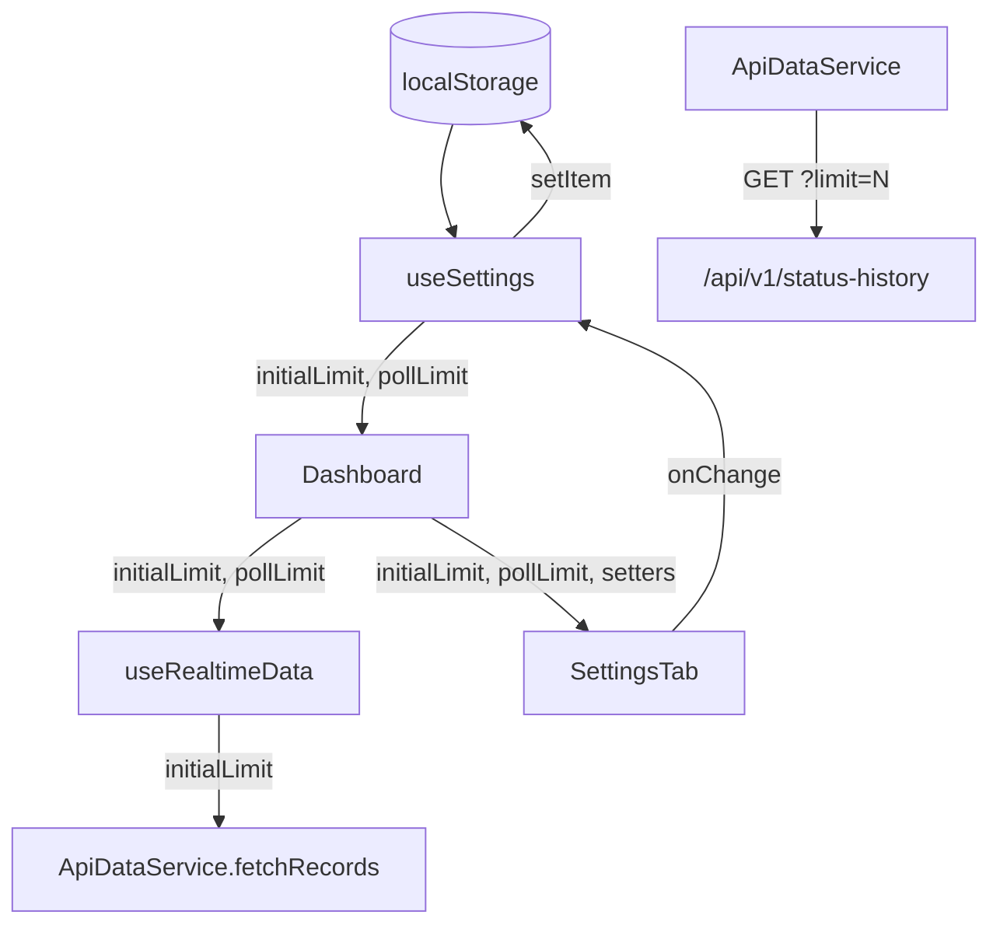

# План: Вынести лимиты записей на вкладку Settings

## Цель

Согласно [FAQ.md](../FAQ.md), лимиты количества записей (`limit=20` при инициализации, `limit=100` при дозагрузке) жёстко зашиты в `ApiDataService`. Требуется вынести управление этими лимитами на вкладку Settings, заменив заглушку "Coming soon..." на полноценный UI с двумя ползунками/числовыми инпутами.

## Текущая архитектура (как есть)

```
Dashboard
 ├── useRealtimeData(new ApiDataService())
 │    └── ApiDataService.fetchRecords()  ← limit=20 хардкод
 │         └── GET /api/v1/status-history?limit=20
 └── SettingsTab → "Coming soon..." (заглушка)
```

Проблема: лимиты нельзя изменить без правки кода.

## Целевая архитектура (как будет)

```
Dashboard
 ├── useSettings() → { initialLimit, pollLimit, setInitialLimit, setPollLimit }
 │    └── localStorage (сохранение между сессиями)
 ├── useRealtimeData(new ApiDataService(), initialLimit, pollLimit)
 │    └── ApiDataService.fetchRecords(initialLimit, pollLimit)
 │         └── GET /api/v1/status-history?limit={initialLimit}
 └── SettingsTab
      ├── initialLimit: ползунок/инпут (1–10000, шаг 1, default: 20)
      └── pollLimit: ползунок/инпут (1–10000, шаг 1, default: 100)
```

## Пошаговый план

### Шаг 1: Создать хук `useSettings`

**Файл:** `src/hooks/useSettings.ts`

- Читает/пишет `initialLimit` и `pollLimit` в `localStorage`.
- Ключи: `settings:initialLimit`, `settings:pollLimit`.
- Значения по умолчанию: `initialLimit = 20`, `pollLimit = 100`.
- Возвращает: `{ initialLimit, pollLimit, setInitialLimit, setPollLimit }`.
- Валидация: значения должны быть в диапазоне [1, 10000] (согласно openapi.yaml).

### Шаг 2: Обновить `DataService` (types.ts)

**Файл:** `src/services/types.ts`

- Изменить сигнатуру `fetchRecords`:
  ```ts
  fetchRecords(initialLimit: number, pollLimit: number): Promise<StatusHistoryRecord[]>;
  ```
  > **Важно:** `pollLimit` пока не используется в `fetchRecords`, но передаётся для единообразия и будущего использования при long polling. На данном этапе `fetchRecords` использует `initialLimit` для определения количества записей.

### Шаг 3: Обновить `MockDataService`

**Файл:** `src/services/mockDataService.ts`

- Изменить `fetchRecords` на `fetchRecords(initialLimit: number)`.
- Вместо хардкода `87` записей генерировать `initialLimit` записей.

### Шаг 4: Обновить `ApiDataService`

**Файл:** `src/services/apiDataService.ts`

- Изменить `fetchRecords` на `fetchRecords(initialLimit: number)`.
- В URL запроса использовать `initialLimit` вместо хардкода `20`:
  ```ts
  const response = await fetch(`/api/v1/status-history?limit=${initialLimit}`);
  ```

### Шаг 5: Обновить `useRealtimeData`

**Файл:** `src/hooks/useRealtimeData.ts`

- Добавить параметры: `useRealtimeData(dataService, initialLimit, pollLimit)`.
- Передавать `initialLimit` в `dataService.fetchRecords(initialLimit)`.
- `pollLimit` пока передаётся, но не используется (задел на будущее).

### Шаг 6: Обновить `Dashboard`

**Файл:** `src/components/Dashboard.tsx`

- Использовать `useSettings()` для получения лимитов.
- Передавать `initialLimit` и `pollLimit` в `useRealtimeData`.
- Передавать `{ initialLimit, pollLimit, setInitialLimit, setPollLimit }` в `SettingsTab`.

### Шаг 7: Реализовать `SettingsTab`

**Файл:** `src/components/tabs/SettingsTab.tsx`

- Принимает пропсы: `initialLimit, pollLimit, onInitialLimitChange, onPollLimitChange`.
- Два блока с label + числовой input (type="number") + ползунок (range input).
- Валидация на лету: min=1, max=10000.
- Стилизация в едином стиле с дашбордом (Tailwind CSS).
- Кнопка "Reset to defaults" для сброса к 20/100.

### Шаг 8: Обновить `FAQ.md`

**Файл:** `FAQ.md`

- Обновить секцию "Где задаётся лимит получаемых с бэка записей?" — указать, что лимиты настраиваются через вкладку Settings.
- Убрать или дополнить информацию о хардкоде.

## Схема потока данных



## Границы значений (согласно openapi.yaml)

| Параметр      | Min | Max  | Default |
|---------------|-----|------|---------|
| initialLimit  | 1   | 10000| 20      |
| pollLimit     | 1   | 10000| 100     |

## Файлы, которые будут изменены

| Файл | Действие |
|------|----------|
| `src/hooks/useSettings.ts` | **Создать** |
| `src/services/types.ts` | Изменить сигнатуру `fetchRecords` |
| `src/services/mockDataService.ts` | Изменить `fetchRecords` |
| `src/services/apiDataService.ts` | Изменить `fetchRecords` |
| `src/hooks/useRealtimeData.ts` | Добавить параметры лимитов |
| `src/components/Dashboard.tsx` | Подключить `useSettings`, передать лимиты |
| `src/components/tabs/SettingsTab.tsx` | **Переписать** полностью |
| `FAQ.md` | Обновить секцию про лимиты |